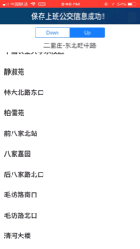
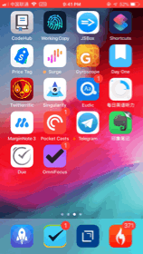
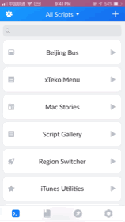
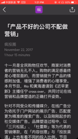
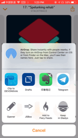

# JSBoxExtensions

一些自用的 JSBox 脚本

## Beijing Bus

[点击使用 JSBox 打开](https://xteko.com/redir?name=BeijingBus&icon=icon_087.png&types=widget&url=https://github.com/hechen/JSBoxExtensions/blob/master/Extensions/BeijingBus.box)

#### 主 App 设置公交车站点信息

#### 定时任务，触发通知展示

#### SIRI

## Share Podcast to DayOne (Overcast, Castro or Pocketcast)

[点击使用 JSBox 打开](https://xteko.com/redir?name=PodcastToDayOne&icon=icon_209.png&types=app,action&url=https://raw.githubusercontent.com/hechen/JSBoxExtensions/master/Extensions/PodcastToDayOne.js)

## Download wallpaper on https://wallpaper.dog

[点击使用 JSBox 打开](https://xteko.com/redir?name=wallpaper.dog.downloader&url=https://raw.githubusercontent.com/hechen/JSBoxExtensions/master/Extensions/wallpaper.dog.downloader.js&icon=icon_014.png&types=app,action)